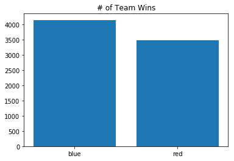
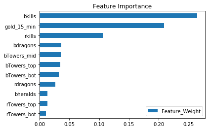

# LOLzorz
## League of Legends Game Outcome Predictor

## Goal
Predict if blue team will win or lose based on first 15 minutes of gameplay

### Data Source
kaggle.com

## EDA
- 7620 matches
- 161 features (including dummy variables)

Which side tends to win more?

<<<<<<< HEAD
Feature Importances

=======
>>>>>>> 32d93f33fb02b860cda512562429dfbe88beeadf
